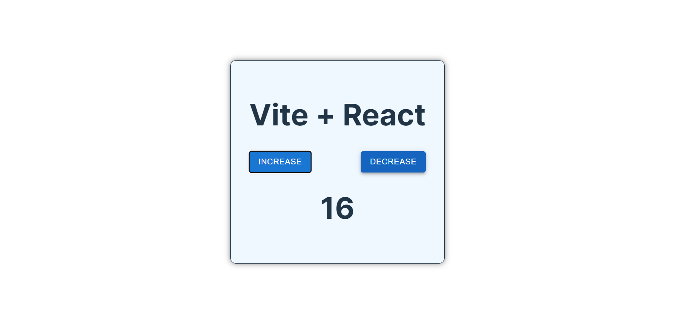

# Counter  React + TypeScript + Vite

understanding what is the problem and then sift to recoil.

- go to the react developer tools and select the profiler and click on the settings.
- select the highlight when the component rerenders.
- you will find that the whole card rerenders when a button is clicked threfore it is not optimized.
- threfore we need to use the recoil.

## image

 

## before recoil

```typescript
  const [count, setCount] = useState(0)

  return (
    <>
     
      <div className="card">
       
      <h1>Vite + React</h1>
      <div style={{display:'flex', justifyContent:'space-between' }}>
        <Button variant="contained" onClick={() => setCount((count) => count + 1)}>
          increase
        </Button>
        <Button variant="contained" onClick={() => setCount((count) => count - 1 )}>
          decrease
        </Button>

      </div>
       
       <h1> {count} </h1>
      </div>
     
    </>
```

## wrong way to use

by defing the state at the top nothing chnages, just use the use recoil value instead of the use recoil state .

```typescript

  const countState = atom({
    key: 'countState', // unique ID (with respect to other atoms/selectors)
    default: 0, // default value (aka initial value)
  });
  //const [count, setCount] = useRecoilState(countState); // do not use this and set it at the top level because it chnages nothing . but use the use recoil value and set recoil

  return (
    <>
     <RecoilRoot>
     <div className="card">
       
       <h1>Vite + React</h1>
       <div style={{display:'flex', justifyContent:'space-between' }}>
         <Button variant="contained" onClick={() => setCount((count) => count + 1)}>
           increase
         </Button>
         <Button variant="contained" onClick={() => setCount((count) => count - 1 )}>
           decrease
         </Button>
 
       </div>
        <div>
          <h1> {count} </h1>
        </div>
      
       </div>

     </RecoilRoot>
```

## what works

Just write everything in a different component and use the set reoil state and use recoil value , it works like magic .

```typescript
   export const CountState = atom({
  key :"countState",
  default: 0,

});

function App() {
 

  const Increase = () => {
    const setCount = useSetRecoilState(CountState);
    return (
      <Button
        variant="contained"
        onClick={() => setCount((count) => count + 1)}
      >
        increase
      </Button>
    );
  };
  const Decrease = () => {
    const setCount = useSetRecoilState(CountState);

    return (
      <Button
        variant="contained"
        onClick={() => setCount((count) => count - 1)}
      >
        decrease
      </Button>
    );
  };
  const CounterDisplay = () => {
    const count = useRecoilValue(CountState);
    return (
      <div>
        <h1> {count} </h1>
      </div>
    );
  };

  return (
    <RecoilRoot>
      <div className="card">
        <h1>Vite + React</h1>
        <div style={{ display: "flex", justifyContent: "space-between" }}>
          <Increase />
          <Decrease />
        </div>
        <CounterDisplay />
      </div>
    </RecoilRoot>
  );
}

export default App;
```
